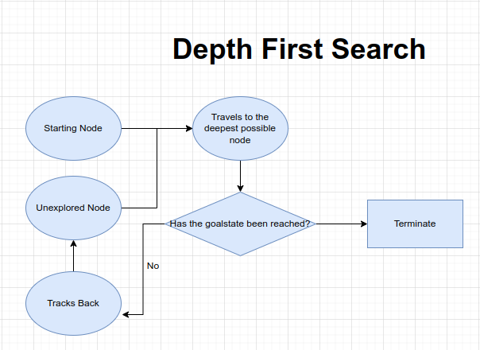
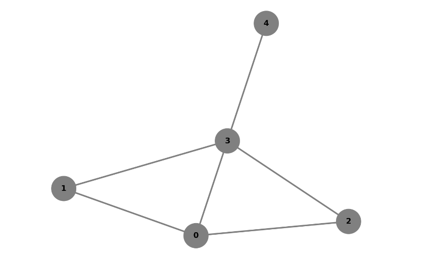
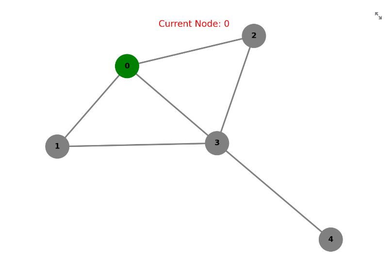
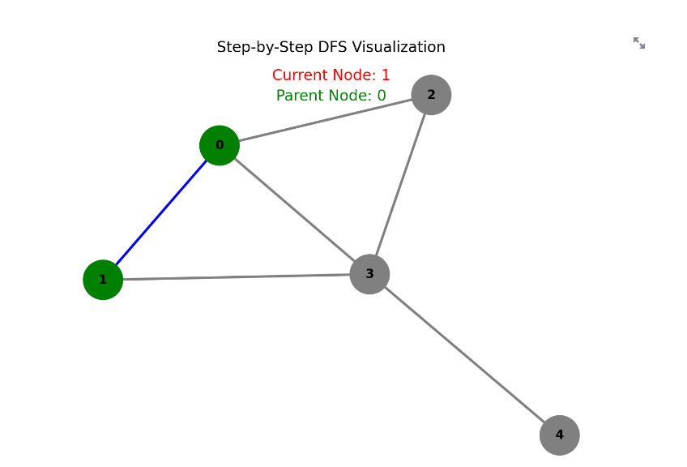
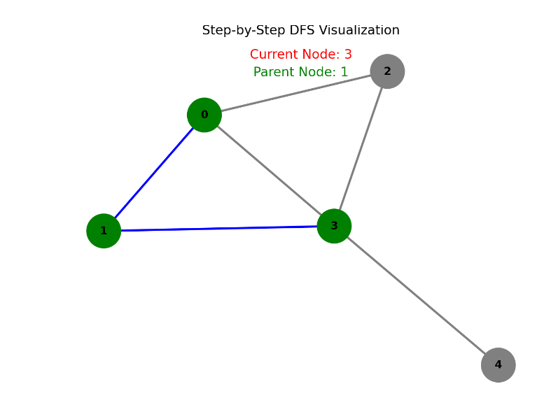
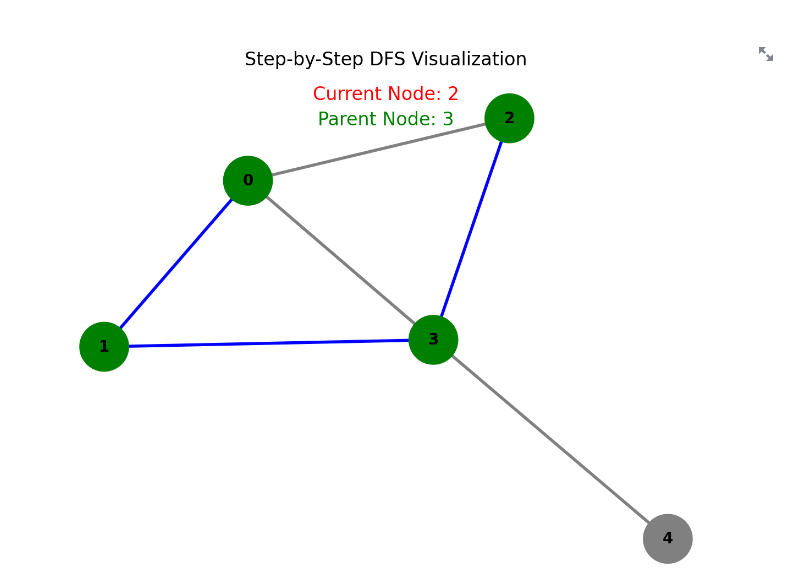
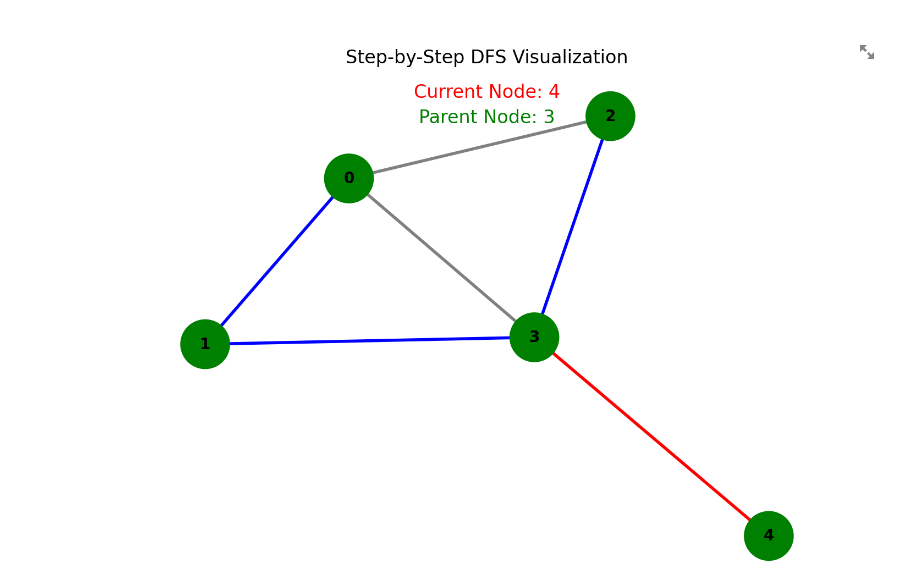

you can run the implementations mentioned here at : https://appliedai-dfs-in-detail.streamlit.app/

# Depth First Search (DFS)

## Introduction:
- Uninformed search technique (*BFS is also an uniformed search technique*)
- This means that at any given time we will only have the present knowledge and not the domain knowledge. 
==*This characteristic reflects the localized nature of DFS. As DFS advances along a path, it progressively builds its understanding of the graph by uncovering adjacent nodes. This approach prioritizes depth over breadth and allows DFS to efficiently explore deeper branches before backtracking. Consequently, DFS is well-suited for scenarios where a comprehensive understanding of the entire graph is not required, and the algorithm can make informed decisions based solely on the immediate context it encounters."*==
- It is very muck like a brute force method.
- Unlike BFS which uses Queue (FIFO), DFS uses the stack data structure (LIFO: Last In First Out)



## Overview
1. What is graph traversal?
2. Intuition behind DFS
3. DFS Implementation
4. DFS Application
***
## 1. What is Graph Traversal?


- you start at a single vertex
- then find a way to visit every other vertex within the graph
- There can be several orders in which you can visit all the vertices within a graph
***
## 2. Intuition behind DFS

- You start at a vertex and ensure you visit every other vertex within the graph.


Taking Node 0 as the starting point
Order 1: 0 1 3 2 4
Order 2: 0 2  3 4 1
and so on........

==**Q. But how do we know that we have visited every single vertex in the graph?**==

In the process of Depth-First Search (DFS) on a graph, when we return to the starting node, it signals that we have successfully visited and explored all the vertices in the graph. This happens because during the traversal, we explore each branch of the graph as deeply as possible before backtracking. By the time we complete the traversal and return to the starting node, we can be certain that we have traversed all the possible neighboring nodes, effectively covering the entire graph. This property makes DFS a powerful algorithm for graph exploration and various applications like pathfinding, connectivity analysis, and more.

## 3.1 DFS Implementation using Recursion

**What is recursion?**
Recursion is a programming technique where a function calls itself as part of its own execution. In other words, a recursive function is a function that solves a problem by breaking it down into smaller, similar sub-problems and solving each sub-problem using the same function.

**Problem**

Valid order for graph traversal using depth-first search (DFS) -
dfs(G,0): 0 1 3 4 2

In this traversal, we naturally follow a recursive pattern:
- Starting Node (Node 0)
- We visit the neighbor of our starting node (Node 1)
- Treat the last visited node as the starting node and then visit its neighbor

**This observation provides an initial insight into how we can implement DFS:**

*Pseudocode:*
```
def dfs(G, v):
    visit(v)
    for w in G.neighbors(v):
        dfs(G, w)
```
Given a graph `G` and a starting node `v`, our process starts by visiting node `v`. Subsequently, for each neighboring node `w` of the current node `v`, we apply DFS on the graph, treating `w` as the new starting node.

It's important to note that we represent the graph using an adjacency list. This makes it easy to find the neighboring nodes of a specific node, simplifying the process of exploring connections within the graph.

==However, there is a significant challenge with this implementation. The concern arises when we transition from iterating Node 0 to Node 1. At this point, Node 1 becomes the new starting point. Here's where the problem emerges: one of the neighbors of Node 1 is Node 0, which has already been traversed. This situation can potentially lead us into a never-ending loop of recursion, causing our program to run indefinitely without any meaningful outcome.==

**How do we fix it?**
- Ideally, our goal is to execute the dfs function on nodes that remain unvisited.
- Achieving this can be done by implementing a marking mechanism for the visited nodes.
- One approach is to keep track of a list of Boolean values, where each value corresponds to a specific vertex in the graph. Initially, all these values are set to false, reflecting that no nodes have been visited. However, upon visiting a node, we can update its corresponding index to true, indicating that we've encountered it.
- Once nodes are appropriately marked, we can confidently trigger DFS recursively on a vertex as long as its associated index is still marked as false. This ensures that we avoid endlessly revisiting nodes that have already been explored.

*Pseudocode:*
```
marked = [False] * G.size()
def dfs(G,v):
	visit(v)
	marked[v] = True
	for w in G.neighbors(v):
		if not marked[w]:
		dfs(G,w)

```
Let's break it down step by step:

1. `marked = [False] * G.size()`: This line creates a list called `marked` with a length equal to the size of the graph `G`. Each element in this list represents whether a corresponding vertex has been visited. Initially, all elements are set to `False` to indicate that no vertices have been visited yet.

2. `def dfs(G, v)`: This line defines the DFS function. It takes two parameters: the graph `G` and the starting vertex `v` from which the traversal begins.

3. `visit(v)`: This is a placeholder for the action you want to perform when visiting a vertex. It represents processing or exploring the vertex.

4. `marked[v] = True`: After visiting the current vertex `v`, this line marks it as visited by setting the corresponding element in the `marked` list to `True`.

5. `for w in G.neighbors(v)`: This loop iterates through each neighbor `w` of the current vertex `v`.

6. `if not marked[w]:`: This conditional statement checks if the neighbor vertex `w` has not been visited yet. If the condition is true (i.e., `marked[w]` is `False`), the code inside the `if` block is executed.

7. `dfs(G, w)`: This line recursively calls the DFS function on the neighbor vertex `w`. This means that the traversal continues from `w`, exploring its neighbors in a similar manner. By doing this, the traversal can explore deeper into the graph.

Putting it all together, this code implements a depth-first search traversal of a graph. It starts from a given vertex, visits it, marks it as visited, and then explores its neighbors recursively, making sure not to revisit vertices that have already been marked as visited. This process continues until all reachable vertices have been visited.
***
## 3.2 DFS Implementation (Iterative)

**What is iteration?**
Iteration is a programming concept that refers to the process of repeatedly executing a set of instructions or a block of code multiple times. It allows you to perform a specific task or operation in a repetitive manner without having to rewrite the same code multiple times. Iteration is essential for tasks like looping through collections of data, performing calculations, and implementing algorithms.

The fundamental contrast between iterative and recursive implementations of DFS lies in their approach to tracking nodes for visitation. The iterative approach employs the stack data structure to manage the nodes awaiting exploration.

*Pseudocode:*

```
def dfs_iter(G, v):
    stack = [v]  // Initialize a stack with the starting vertex

    while stack is not empty:
        v = stack.pop()  // Pop the last vertex from the stack

        if not marked[v]:  // If the vertex hasn't been visited yet
            visit(v)  // Perform an action when visiting the vertex
            marked[v] = True  // Mark the vertex as visited

            for w in G.neighbors(v):  // Loop through neighbors of the vertex
                if not marked[w]:  // If the neighbor hasn't been visited
                    stack.push(w)  // Push the neighbor onto the stack
```

Here's a step-by-step breakdown of what this pseudocode does:

1. Start with a stack containing the initial vertex `v`.
2. Enter a loop that continues as long as there are vertices in the stack.
3. Inside the loop, pop a vertex `v` from the stack.
4. If the vertex `v` has not been visited (`marked[v]` is `False`), then:
   - Perform an action, such as visiting or processing the vertex.
   - Mark the vertex `v` as visited by setting `marked[v]` to `True`.
   - Loop through the neighbors of vertex `v`.
     - If a neighbor `w` has not been visited, push it onto the stack for later exploration.

This iterative approach simulates the depth-first traversal of the graph by explicitly managing the stack of vertices to be visited. It ensures that vertices are visited and explored one by one, mimicking the behavior of recursion without using actual function calls.

**Problem:** Traverse the graph using DFS (Iterative)


**Step 1**
- Starting Node: 0
- Stack: |0|
- Popping off the last entry
- Marked: False
- Visited: [0]
- Order: ==0==


**Step 2**
- Neighbors of node 0: 2	3	1
- Unvisited: 2	3	1
- Stack: |2|3|1|
- Popping off the last entry
- Marked: False
- Visited: [1]
- Order: ==0	1==

**Step 3**
- neighbors of node 1: 0	3
- unvisited: 3
- stack: |2|3|3|
- popping off the last entry
- Marked: False
- Visited: [3]
- Order: ==0 1 3==


**Step 4**
- neighbors of node 3: 0 1 4 2
- unvisited: 2 4
- stack: |2|3|4|2|
- popping off the last entry
- Marked: False
- visited: [2]
- Order: ==0 1 3 2==


**Step 5**
- neighbors of node 2: 0 3
- unvisited: none
- stack: |2|3|4|
- popping of the last entry 
- Marked: False
- visited: [4]
- order: ==0 1 3 2 4==


**Now we see that all the nodes have been visited. But the search won't terminate is the stack is still non empty**

**Step 6**
- neighbors of node: *NA*
- stack: |2|3|
- popping off the last entry
- Marked: True
- Visted:[]
- order: ==0 1 3 2 4==

**Step 7**
- neighbors of node: *NA*
- stack: |2|
- popping off the last entry
- Marked: True
- Visted:[]
- order: ==0 1 3 2 4==

**Now, our stack is empty, therefore the search terminates and our final order of visiting all the nodes is: ==0 1 3 2 4==**

